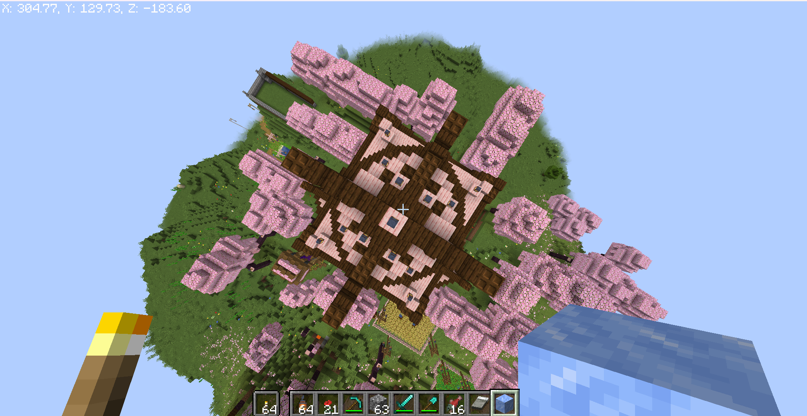
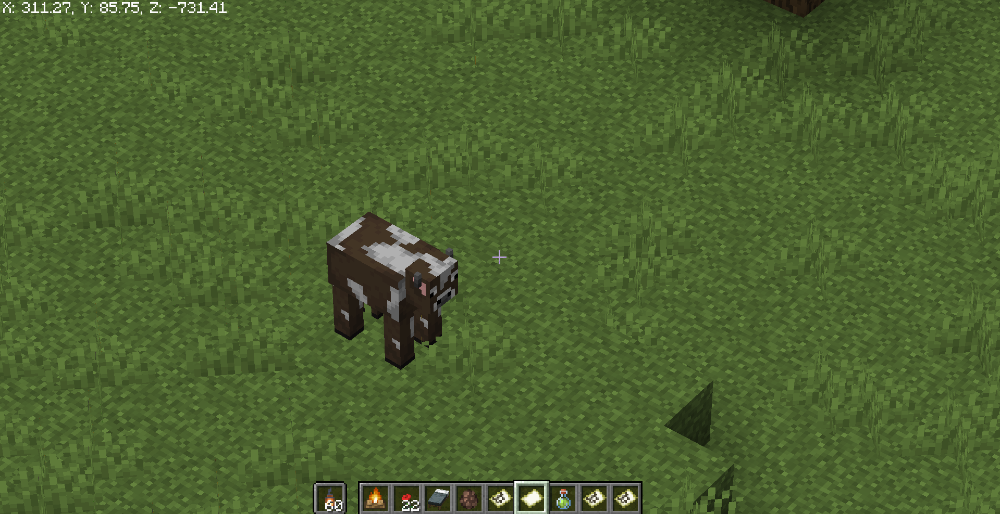
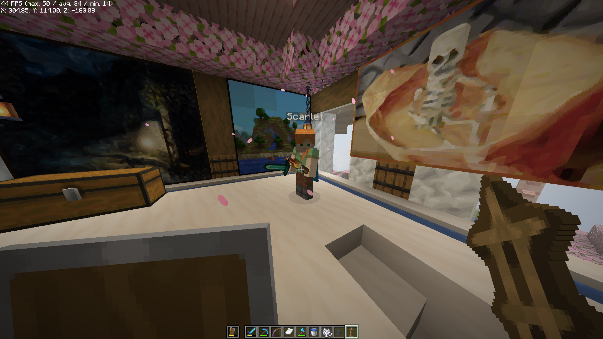

# Image Gallery

<table style="width: 100%;">
  <tr>
    <td style="width: 33%;"></td>
    <td style="width: 33%;"></td>
    <td style="width: 33%;"></td>
  </tr>
  <tr>
    <td style="width: 33%;"></td>
    <td style="width: 33%;"></td>
    <td style="width: 33%;"></td>
  </tr>
  <tr>
    <td style="width: 33%;"></td>
    <td style="width: 33%;"></td>
    <td style="width: 33%;"></td>
  </tr>
  <tr>
    <td style="width: 33%;"></td>
    <td style="width: 33%;"></td>
    <td style="width: 33%;"></td>
  </tr>
  <tr>
    <td style="width: 33%;"></td>
    <td style="width: 33%;"></td>
    <td style="width: 33%;"></td>
  </tr>
  <tr>
    <td style="width: 33%;"></td>
    <td style="width: 33%;"></td>
    <td style="width: 33%;"></td>
  </tr>
  <tr>
    <td style="width: 33%;"></td>
    <td style="width: 33%;"></td>
    <td style="width: 33%;"></td>
  </tr>
  <tr>
    <td style="width: 33%;"></td>
    <td style="width: 33%;"></td>
    <td style="width: 33%;"></td>
  </tr>
  <tr>
    <td style="width: 33%;"></td>
    <td style="width: 33%;"></td>
    <td style="width: 33%;"></td>
  </tr>
  <tr>
    <td style="width: 33%;"></td>
    <td style="width: 33%;"></td>
    <td style="width: 33%;"></td>
  </tr>
  <tr>
    <td style="width: 33%;"></td>
    <td style="width: 33%;"></td>
    <td style="width: 33%;"></td>
  </tr>
  <tr>
    <td style="width: 33%;"></td>
    <td style="width: 33%;"></td>
    <td style="width: 33%;"></td>
  </tr>
  <tr>
    <td style="width: 33%;"></td>
    <td style="width: 33%;"></td>
    <td style="width: 33%;"></td>
  </tr>
  <tr>
    <td style="width: 33%;"></td>
    <td style="width: 33%;"></td>
    <td style="width: 33%;"></td>
  </tr>
  <tr>
    <td style="width: 33%;"></td>
    <td style="width: 33%;"></td>
    <td style="width: 33%;"></td>
  </tr>
  <tr>
    <td style="width: 33%;"></td>
    <td style="width: 33%;"></td>
    <td style="width: 33%;"></td>
  </tr>
  <tr>
    <td style="width: 33%;"></td>
    <td style="width: 33%;"></td>
    <td style="width: 33%;"></td>
  </tr>
  <tr>
    <td style="width: 33%;"></td>
    <td style="width: 33%;"></td>
    <td style="width: 33%;"></td>
  </tr>
  <tr>
    <td style="width: 33%;"></td>
    <td style="width: 33%;"></td>
    <td style="width: 33%;"></td>
  </tr>
  <tr>
    <td style="width: 33%;"></td>
    <td style="width: 33%;"></td>
    <td style="width: 33%;"></td>
  </tr>
  <tr>
    <td style="width: 33%;"></td>
    <td style="width: 33%;"></td>
    <td style="width: 33%;"></td>
  </tr>
  <tr>
    <td style="width: 33%;"></td>
    <td style="width: 33%;"></td>
    <td style="width: 33%;"></td>
  </tr>
  <tr>
    <td style="width: 33%;"></td>
    <td style="width: 33%;"></td>
    <td style="width: 33%;"></td>
  </tr>
  <tr>
    <td style="width: 33%;"></td>
    <td style="width: 33%;"></td>
    <td style="width: 33%;"></td>
  </tr>
  <tr>
    <td style="width: 33%;"></td>
    <td style="width: 33%;"></td>
    <td style="width: 33%;"></td>
  </tr>
  <tr>
    <td style="width: 33%;"></td>
    <td style="width: 33%;"></td>
    <td style="width: 33%;"></td>
  </tr>
  <tr>
    <td style="width: 33%;"></td>
    <td style="width: 33%;"></td>
    <td style="width: 33%;"></td>
  </tr>
  <tr>
    <td style="width: 33%;"></td>
    <td style="width: 33%;"></td>
    <td style="width: 33%;"></td>
  </tr>
  <tr>
    <td style="width: 33%;"></td>
    <td style="width: 33%;"></td>
    <td style="width: 33%;"></td>
  </tr>
  <tr>
    <td style="width: 33%;"></td>
    <td style="width: 33%;"></td>
    <td style="width: 33%;"></td>
  </tr>
  <tr>
    <td style="width: 33%;"></td>
    <td style="width: 33%;"></td>
    <td style="width: 33%;"></td>
  </tr>
  <tr>
    <td style="width: 33%;"></td>
    <td style="width: 33%;"></td>
    <td style="width: 33%;"></td>
  </tr>
  <tr>
    <td style="width: 33%;"></td>
    <td style="width: 33%;"></td>
    <td style="width: 33%;"></td>
  </tr>
  <tr>
    <td style="width: 33%;"></td>
    <td style="width: 33%;"></td>
    <td style="width: 33%;"></td>
  </tr>
  <tr>
    <td style="width: 33%;"></td>
    <td style="width: 33%;"></td>
    <td style="width: 33%;"></td>
  </tr>
  <tr>
    <td style="width: 33%;"></td>
    <td style="width: 33%;"></td>
    <td style="width: 33%;"></td>
  </tr>
  <tr>
    <td style="width: 33%;"></td>
    <td style="width: 33%;"></td>
    <td style="width: 33%;"></td>
  </tr>
  <tr>
    <td style="width: 33%;"></td>
    <td style="width: 33%;"></td>
    <td style="width: 33%;"></td>
  </tr>
  <tr>
    <td style="width: 33%;"></td>
    <td style="width: 33%;"></td>
    <td style="width: 33%;"></td>
  </tr>
  <tr>
    <td style="width: 33%;"></td>
    <td style="width: 33%;"></td>
    <td style="width: 33%;"></td>
  </tr>
  <tr>
    <td style="width: 33%;"></td>
    <td style="width: 33%;"></td>
    <td style="width: 33%;"></td>
  </tr>
  <tr>
    <td style="width: 33%;"></td>
    <td style="width: 33%;"></td>
    <td style="width: 33%;"></td>
  </tr>
  <tr>
    <td style="width: 33%;"></td>
    <td style="width: 33%;"></td>
    <td style="width: 33%;"></td>
  </tr>
  <tr>
    <td style="width: 33%;"></td>
    <td style="width: 33%;"></td>
    <td style="width: 33%;"></td>
  </tr>
  <tr>
    <td style="width: 33%;"></td>
    <td style="width: 33%;"></td>
    <td style="width: 33%;"></td>
  </tr>
  <tr>
    <td style="width: 33%;"></td>
    <td style="width: 33%;"></td>
    <td style="width: 33%;"></td>
  </tr>
  <tr>
    <td style="width: 33%;"></td>
    <td style="width: 33%;"></td>
    <td style="width: 33%;"></td>
  </tr>
  <tr>
    <td style="width: 33%;"></td>
    <td style="width: 33%;"></td>
    <td style="width: 33%;"></td>
  </tr>
  <tr>
    <td style="width: 33%;"></td>
    <td style="width: 33%;"></td>
    <td style="width: 33%;"></td>
  </tr>
  <tr>
    <td style="width: 33%;"></td>
    <td style="width: 33%;"></td>
    <td style="width: 33%;"></td>
  </tr>
  <tr>
    <td style="width: 33%;"></td>
    <td style="width: 33%;"></td>
    <td style="width: 33%;"></td>
  </tr>
  <tr>
    <td style="width: 33%;"></td>
    <td style="width: 33%;"></td>
    <td style="width: 33%;"></td>
  </tr>
  <tr>
    <td style="width: 33%;"></td>
    <td style="width: 33%;"></td>
    <td style="width: 33%;"></td>
  </tr>
  <tr>
    <td style="width: 33%;"></td>
    <td style="width: 33%;"></td>
    <td style="width: 33%;"></td>
  </tr>
  <tr>
    <td style="width: 33%;"></td>
    <td style="width: 33%;"></td>
    <td style="width: 33%;"></td>
  </tr>
  <tr>
    <td style="width: 33%;"></td>
    <td style="width: 33%;"></td>
    <td style="width: 33%;"></td>
  </tr>
  <tr>
    <td style="width: 33%;"></td>
    <td style="width: 33%;"></td>
    <td style="width: 33%;"></td>
  </tr>
  <tr>
    <td style="width: 33%;"></td>
    <td style="width: 33%;"></td>
    <td style="width: 33%;"></td>
  </tr>
  <tr>
    <td style="width: 33%;"></td>
    <td style="width: 33%;"></td>
    <td style="width: 33%;"></td>
  </tr>
  <tr>
    <td style="width: 33%;"></td>
    <td style="width: 33%;"></td>
    <td style="width: 33%;"></td>
  </tr>
  <tr>
    <td style="width: 33%;"></td>
    <td style="width: 33%;"></td>
    <td style="width: 33%;"></td>
  </tr>
  <tr>
    <td style="width: 33%;"></td>
    <td style="width: 33%;"></td>
    <td style="width: 33%;"></td>
  </tr>
  <tr>
    <td style="width: 33%;"></td>
    <td style="width: 33%;"></td>
    <td style="width: 33%;"></td>
  </tr>
  <tr>
    <td style="width: 33%;"></td>
    <td style="width: 33%;"></td>
    <td style="width: 33%;"></td>
  </tr>
  <tr>
    <td style="width: 33%;"></td>
    <td style="width: 33%;"></td>
    <td style="width: 33%;"></td>
  </tr>
  <tr>
    <td style="width: 33%;"></td>
    <td style="width: 33%;"></td>
    <td style="width: 33%;"></td>
  </tr>
  <tr>
    <td style="width: 33%;"></td>
    <td style="width: 33%;"></td>
    <td style="width: 33%;"></td>
  </tr>
  <tr>
    <td style="width: 33%;"></td>
    <td style="width: 33%;"></td>
    <td style="width: 33%;"></td>
  </tr>
  <tr>
    <td style="width: 33%;"></td>
    <td style="width: 33%;"></td>
    <td style="width: 33%;"></td>
  </tr>
  <tr>
    <td style="width: 33%;"></td>
    <td style="width: 33%;"></td>
    <td style="width: 33%;"></td>
  </tr>
  <tr>
    <td style="width: 33%;"></td>
    <td style="width: 33%;"></td>
    <td style="width: 33%;"></td>
  </tr>
  <tr>
    <td style="width: 33%;"></td>
    <td style="width: 33%;"></td>
    <td style="width: 33%;"></td>
  </tr>
  <tr>
    <td style="width: 33%;"></td>
    <td style="width: 33%;"></td>
    <td style="width: 33%;"></td>
  </tr>
  <tr>
    <td style="width: 33%;"></td>
    <td style="width: 33%;"></td>
    <td style="width: 33%;"></td>
  </tr>
  <tr>
    <td style="width: 33%;"></td>
    <td style="width: 33%;"></td>
    <td style="width: 33%;"></td>
  </tr>
  <tr>
    <td style="width: 33%;"></td>
    <td style="width: 33%;"></td>
    <td style="width: 33%;"></td>
  </tr>
  <tr>
    <td style="width: 33%;"></td>
    <td style="width: 33%;"></td>
    <td style="width: 33%;"></td>
  </tr>
  <tr>
    <td style="width: 33%;"></td>
    <td style="width: 33%;"></td>
    <td style="width: 33%;"></td>
  </tr>
  <tr>
    <td style="width: 33%;"></td>
    <td style="width: 33%;"></td>
    <td style="width: 33%;"></td>
  </tr>
  <tr>
    <td style="width: 33%;"></td>
    <td style="width: 33%;"></td>
    <td style="width: 33%;"></td>
  </tr>
  <tr>
    <td style="width: 33%;"></td>
    <td style="width: 33%;"></td>
    <td style="width: 33%;"></td>
  </tr>
  <tr>
    <td style="width: 33%;"></td>
    <td style="width: 33%;"></td>
    <td style="width: 33%;"></td>
  </tr>
  <tr>
    <td style="width: 33%;"></td>
    <td style="width: 33%;"></td>
    <td style="width: 33%;"></td>
  </tr>
  <tr>
    <td style="width: 33%;"></td>
    <td style="width: 33%;"></td>
    <td style="width: 33%;"></td>
  </tr>
  <tr>
    <td style="width: 33%;"></td>
    <td style="width: 33%;"></td>
    <td style="width: 33%;"></td>
  </tr>
  <tr>
    <td style="width: 33%;"></td>
    <td style="width: 33%;"></td>
    <td style="width: 33%;"></td>
  </tr>
  <tr>
    <td style="width: 33%;"></td>
    <td style="width: 33%;"></td>
    <td style="width: 33%;"></td>
  </tr>
  <tr>
    <td style="width: 33%;"></td>
    <td style="width: 33%;"></td>
    <td style="width: 33%;"></td>
  </tr>
  <tr>
    <td style="width: 33%;"></td>
    <td style="width: 33%;"></td>
    <td style="width: 33%;"></td>
  </tr>
  <tr>
    <td style="width: 33%;"></td>
    <td style="width: 33%;"></td>
    <td style="width: 33%;"></td>
  </tr>
  <tr>
    <td style="width: 33%;"></td>
    <td style="width: 33%;"></td>
    <td style="width: 33%;"></td>
  </tr>
  <tr>
    <td style="width: 33%;"></td>
    <td style="width: 33%;"></td>
    <td style="width: 33%;"></td>
  </tr>
  <tr>
    <td style="width: 33%;"></td>
    <td style="width: 33%;"></td>
    <td style="width: 33%;"></td>
  </tr>
  <tr>
    <td style="width: 33%;"></td>
    <td style="width: 33%;"></td>
    <td style="width: 33%;"></td>
  </tr>
  <tr>
    <td style="width: 33%;"></td>
    <td style="width: 33%;"></td>
    <td style="width: 33%;"></td>
  </tr>
  <tr>
    <td style="width: 33%;"></td>
    <td style="width: 33%;"></td>
    <td style="width: 33%;"></td>
  </tr>
  <tr>
    <td style="width: 33%;"></td>
    <td style="width: 33%;"></td>
    <td style="width: 33%;"></td>
  </tr>
  <tr>
    <td style="width: 33%;"></td>
    <td style="width: 33%;"></td>
    <td style="width: 33%;"></td>
  </tr>
  <tr>
    <td style="width: 33%;"></td>
  </tr>
</table>
